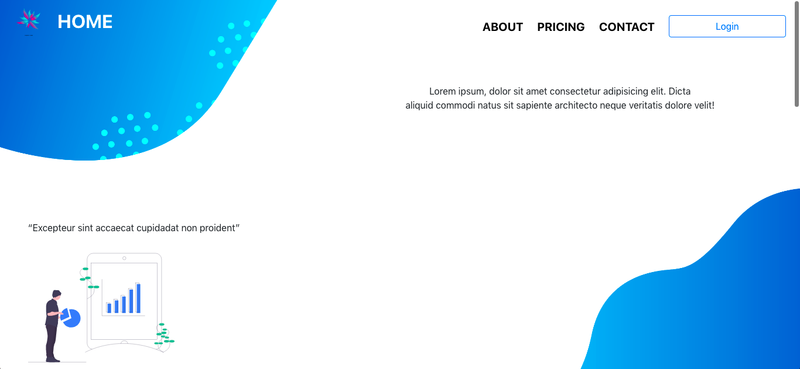

## <b>How To Use</b>
 
<i>make sure you're in right directory</i>
 
 
run <i><b>npm install</b></i>
 
run <i><b>npm start</b></i>

  

## <b>Technologies</b>
 

<b>React JS :</b> as requirement

<b>React Router :</b> for switch between page

<b>React Bootstrap - Bootstrap :</b> make a beautiful UI

<b>SASS :</b> for styling component

<b>Chart JS :</b> for adding a Chart 

<small>`* note : you can filter your chart dynamically`</small>
  

<i><b>Adobe Illustrator :</b> website theme requirement</i>

  

## <b>What are inside of this program</b>
 
<b>Login :</b> To Identified User
 
<b>Home :</b> Back to first page that you see when you're running this program
 
<b>About :</b> Direct to Vision and Mission(s) of Company
 
<b>Pricing :</b> Show you company's service, that you can buy it
 
<b>Contact :</b> Show you company's information and contact
 
 
 

### <b>Our Service(s)</b>

`They are 3 (TIER) categories : `

#### `Basic` | TIER I

1. you can note your goods 

<i>for in and out goods table, if your screen to small, you can be swiped on the table to see all of your data</i>

2. also note your profit each month

You can click `try` button to see what are their services on `basic`

  

#### `Business` | TIER II

\* <i> it's same with `basic` category, but we've additional service for `business` category, they are : </i>

1. Analyst your revenue with `CHART`

2. If you have any trouble on company's service, we give you `support service for 7x24 hours` by click `chat logo button`

  

#### `Entrepreneur` | TIER III

\* <i>it's same with `business` category, but we've additional service for `entrepreneur` category, we give you more than more, here's you're :</i>

1. Available to `export data to Excel`

2. `AI Prediction` revenue, it a system that you can use before take a action for your company, it will give you same prediction for future market.

    
<b><i>`@IrwanKhaliq` github account</i></b>